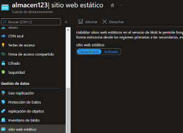
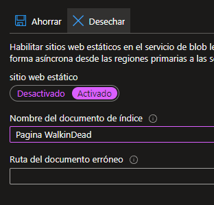

# DATOS Y ALMACEN

**Storage: Proporciona servicios de almacenamiento de archivos y objetos.**

### Cuenta de Almacenamiento de Azure

- **Modelo de servicio:** IaaS.
- **Caracteristicas:** Seguridad, alta, disponibilidad, durabilidad y escalabilidad.

La cuenta de almacenamiento de es la que contiene todos los objetos de los demas servicios.

-----------------------------------------------------------------------------------

## Azure Blob Storage

Funciona para compartir archivos a nivel publico y para almacenar grandes cantidades de archivos.

Tambien sirve para maquinas web.

Puede usarse como reslpaldo de las maquinas virtuales.

Archivos de bases de datos, se pueden guardar aca. 

Funciona como copia de seguridad de una base de datos.

- **Modelo de Servicio:** IaaS 
- **Funcion:** Para almacenar objetos grandes como videos.
- **Funcion:** No esta limitado a formatos de archivos.
- **Funcion:** Almacenar hasta 8TB de las maquinas virtuales.
- **Cuando usar:** Streaming de video o audio.

-----------------------------------------------------------------------------------------

## Azure File Storage

Almacena archivos mas pequeños, controla mejor su acceso, archivos mas privados o tambien para migrar de un ambiente local a Azure.

Controla mejor los archivos, funciona como disco duro de todas las maquinas virtuales.

- **Modelo de servicio:** IaaS.
- **Funcion:** Para compartir archivos y controlar su acceso.
- **Funcion:** Facilita la migracion de local a Azure.
- **Funcion:** Acceso de archivos desde varias maquinas virtuales.
- **cuando usar:** Compartir datos a traves del mundo.

------------------------------------------------------------------------------

## Azure Disk Storage

Es muy rapido mas que los discos tradicionales

Funcion: Discos para las maquinas virtuales
opciones: Puede ser HHD,SSD, SSD Premium y Ultra Disks.

-------------------------------------------------------------------------------------------

## Azure Queue Storage  *(Queue= significa cola)*

Lo que hace es encolar mensajes.

Mensajes pequeños o textos pequeños.

El primer mensaje que llega, es el primero que sale.

- **Modelo de servicio:** IaaS
- **Funcion:** Para almacenar cantidades de mensajes.
- **Caracteristicas:** Accesibles por HTTP o HTTPS.
- **Caracteristicas:** Encola mensajes de hasta 64KB.
- **Cuando usar:** Respuestas de APIs, servicios de mensajeria, loT.

**NOTAS:**

**Almacenamiento con redundancia local (LRS)**---> Copia de seguridad en el mismo server.
**Almacenamiento con redundancia geografica (GRS)**----> Copia de seguridad en otra region.
**Almacenamiento con redundancia de zona (ZRS)**----> Copia de seguridad en zona de disponibilidad  **(Este seria mas rapido).**
**Almacenamiento con redundancia de zona geografica (GZRS)**----> Copia de seguridad en otra region y zoda de disponibilidad **(este es mas rapido y los datos se van a otro lado ES MEJOR).**

-------------------------------------------------------------------------------------

### Pasos para crear una almacenamiento Blob Storage

1.- abrimos el 

2.- buscamos cuentas de almacenamiento, para crear una cuenta.

3.- creamos una cuenta de almacenamiento.

4.- dejemos que la cuenta se cree

5.- cuando finalice, hay que darle ir al recurso

6.- Hay que buscar el Blob Storage, que esta en la seccion de contenedores.

7.- Ahora vamos a crear un contendor.

8.- Le damos un nombre donde debe estar pegado y sin espacio, tambien agregamos que el nivel de acceso publico sea anonimo.

**Nota: Lo anonimo es para que todos en el mundo puedan ver esto.**

9,. Le damos crear

10.- Ahora vamos a entrar al contenedor haciendo click.

11.- Ahora vamos a cargar un archivo y una imagen, el que tu desees.

12.- Y podremos verlo ya en el almacen.

13.- ahora, si le damos click en la imagen, podremos ver un link.

14.- Cuando copiemos ese link y lo peguemos en una pestaña, veremos nuestra imagen.

15.- Ahora subiremos una pagina.

16.- si subimos una pagina con frames, con animaciones, se visualizara solo el codigo, por lo que debemmos hacer paginas estaticas

17.- La forma de hacer una pagina estatica es ir a nuestro almacen y buscar sitio web estatico para darle que se active.

18.- le escribimos un nombre y le damos guardar.

19.- Nos crea un contenedor llamdo Web.

20.-Si nos vamos a los contenedores, podremos ver que ya esta ahi.

21.- Cuando entramos al contenedor web, aca podremos subir la pagina web pero archivo por archivo.

------------------------------------------------------------------------------------------------------------------------------------------------------------------------------
